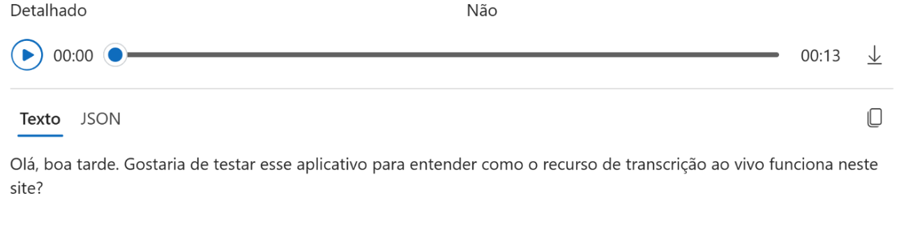
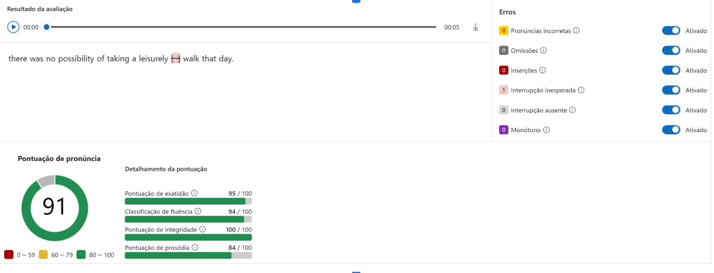

# Desafio do Projeto - Azure Speech Studio e Language Studio
O foco deste laboratório é o uso das ferramentas **Azure Speech Studio** e **Language Studio**, com o objetivo de analisar fala e linguagem natural usando inteligência artificial.

## 🎯 Objetivos do Desafio
- Aplicar os conceitos de IA de linguagem e fala em um ambiente real;
- Documentar os testes realizados com clareza;
- Utilizar o GitHub como ferramenta de versionamento e compartilhamento técnico.

---
## 🧪 Atividades Realizadas:

### 1. Speech Studio - Transcrição de Áudio

**Descrição:**  
Testei a funcionalidade de transcrição de fala para texto em **português**.

**Resultado:**  
A transcrição foi majoritariamente correta, mas notei um erro de **pontuação**, onde uma frase afirmativa foi interpretada como uma pergunta.

**Insight:**  
Apesar da precisão geral ser boa, é importante considerar que essas ferramentas ainda podem cometer erros de interpretação, especialmente com entonações sutis.

**Imagem do Teste:**  
 <!-- Substitua pelo caminho correto -->

---

### 2. Speech Studio - Avaliação de Pronúncia em Inglês

**Descrição:**  
Avaliei minha pronúncia em inglês usando a ferramenta de avaliação.

**Limitação:**  
A versão gratuita permite apenas **5 segundos de fala**, mas já foi suficiente para visualizar como a avaliação funciona.

**Resultado:**  
Recebi feedback imediato sobre a pronúncia, o que pode ser útil para fins educacionais.

**Imagem do Teste:**  

---

### 3. Language Studio - Análise de Sentimentos

**Descrição:**  
Realizei um teste com um **texto mais longo**, avaliando os sentimentos por frase.

**Funcionalidade Testada:**  
- Detecção de idioma  
- Análise de sentimento (positivo, negativo, neutro)  
- Extração de frases-chave  
- Identificação de entidades (localizações, pessoas, etc.)

**Resultado:**  
A análise dividiu o texto frase por frase e atribuiu sentimentos com base no conteúdo.

**Imagem do Teste:**  

---

## 🔗 Recursos Úteis

- [Azure Speech Studio](https://speech.microsoft.com/)
- [Azure Language Studio](https://language.cognitive.azure.com/)
